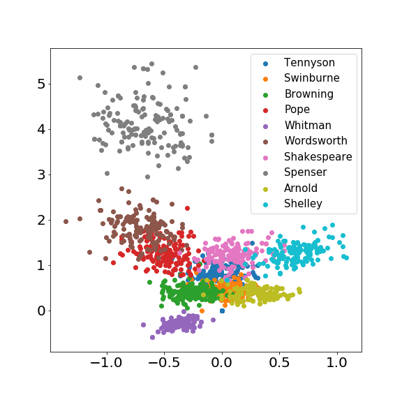
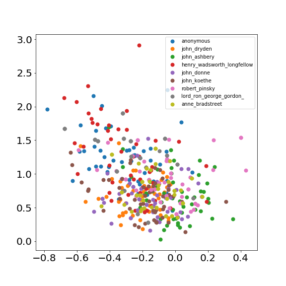

# AuthorEncoder

Find poetry authors who writes similar to your dearest poems.

Would it be great if,  after reading a touching poem, we could find authors who have similar ideas or style? To this end, I built a scalable recommendation system that takes  as input a poem and outputs authors that write similarly. Bookshops can scale this service to empower their customers, boosting sales and loyalty. The underlying AI results from applying computer vision techniques  to encode the legacy of a hundred of classic and modern poets. 

## How does it work?

Tipically, recomendation systems are based on what other people like. Instead, AuthorEncoder makes recomendations based on 
on the poems themselfs. How is this possible? you might be asking. The answer is bringing the triple tecnique of [FaceNet: A Unified Embedding for Face Recognition and Clustering](https://arxiv.org/abs/1503.03832) to natural language processing.

Precisely, we wrangled and processed poems. Several processing options were tried and there were plenty of challenges with the data set in particular: different languange, anonymous authors, multiple editions, old-fashion English, etc. The arquitecture that optimized best the model was a GLOVE embedding followed by a series of convolutional and pool layers. We also used seqeunce models as GRU adn LSTM but the increase in accuracy was marginal at a large cost in speed. 

## AuthorEncoder in action

The files to deploy and serve this project on SageMaker and included on /src/sagemaker. We used a rest API and a lambda function. Then build a html website which can be executed locally or uploaded to a server. Here is an example:

## About used data

The data to training this model can be found on [John Hallman repo](https://github.com/johnhallman/poem-data-processing) which to my understanding contains the larger [poetryfoundation.org](poetryfoundation.org). The required wrangling can be found on 
wrangling and EDA. 

## Quick start

Use the docker file in the build folder, execute run_pipeline and go to /src/results.ipynb to 
see results and work locally.

## Performance
With this quick start, which trains on the 10 poets with largest corpuses on the data set, one 
obtains the following embedding:

  

Then, one can adjust a K nearest neighboors classification algorithm to check the accuracy 
of the model. On a separate training set solely of poems, never seem by the training and validation sets,
still recognizes authoship

  

reachign a 34% balanced accuracy with the KNN previously fitted. Furthermore, to test is this is really an encoder (embedding)
not just for new poems but for NEW AUTHORS, we use the model to embbed another 10 different authors

  

Again, this time the balanced accuracy of a KNN classifier deacreases to 22 %. Future developments, will use largest corpuses and 
try different word/sensentece/ to preprocess authors corpuses. 

---
## Parameters of poems processing

processing_wrangle.py takes clean data and 

| Parameter  | Description | Default |
| ------------- | ------------- | ------------- |
|--data_dir | dir of wrangled data to process|../data/wrangled/ | 
|--data_file | wrangled data-file to process | wrangled_data.csv | 
|--process_dir | dir to dump processed data | ../data/processed/| 
|--split_into | max words per poem extract |100 |
|--min_words_per_author | Author min corpus word length | 2500 |
|--chars_to_keep | chars to keep  | \n?! |
|--no_white_space | Remove multiple white space | True |
|--no_newlines | bool | Remove multiple new lines | True |
|--max_authors | Keep authors with larges corpus | 10 |
|--min_authors | Larges corpus starting from author | 0 |
|--train_test_ratio | Train test ratio | 0.9 |
|--seed | Seed for replicability | 1234 |

## Parameters to create the GLOVE word embedding, dictionary and tokenize poems

| Parameter  | Description | Default |
| ------------- | ------------- | ------------- |
| --data_dir | dir of data | ../data/wrangled/ |
| --train_data_file | train data file | top10_train.json | 
| --test_data_file' | test data file | top10_test.json |
| --word_length | word_lenght to cut and pad poem extracts | 101 |
| --max_vocab_size | max number of words in vocab  | 20_000 |
| --train_valid_ratio | ratio train valid  | 0.9 |
| --seed | Seed for replicability | 1234 |

## Parameters of the CNN based architecture

| Parameter  | Description | Default |
| ------------- | ------------- | ------------- |
| --epochs | number of epochs to train  | 20 |
| --seed | random seed | 1 |
| --dropout | dropout parameter | 0.5 |
| --lr | learning rate | 4e-3 | 
| --margin | triplet loss margin  | 0.24 |
| --n_classes | number of classes | 10 |
| --n_samples | number of samples | 10 |
| --data_dir | Path to data | ../data/processed/ | 
| --model_dir |  Dir for weights and model settings | ./trained_models/ | 
| --data_file | data file name | top_10_authors.json |

## References

FaceNet: A Unified Embedding for Face Recognition and Clustering (https://arxiv.org/pdf/1503.03832.pdf), also 
see https://arxiv.org/pdf/1703.07737.pdf and https://omoindrot.github.io/triplet-loss)
The triplet loss tools used are based on [Adam Bielski](https://github.com/adambielski/siamese-triplet) 
pytorch implementation of triplet loss.
The best performing model is an implementation of [CNN for sentence classification](https://arxiv.org/abs/1408.5882)

