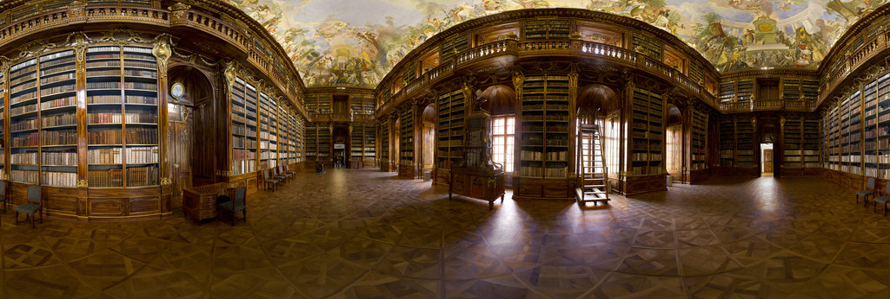
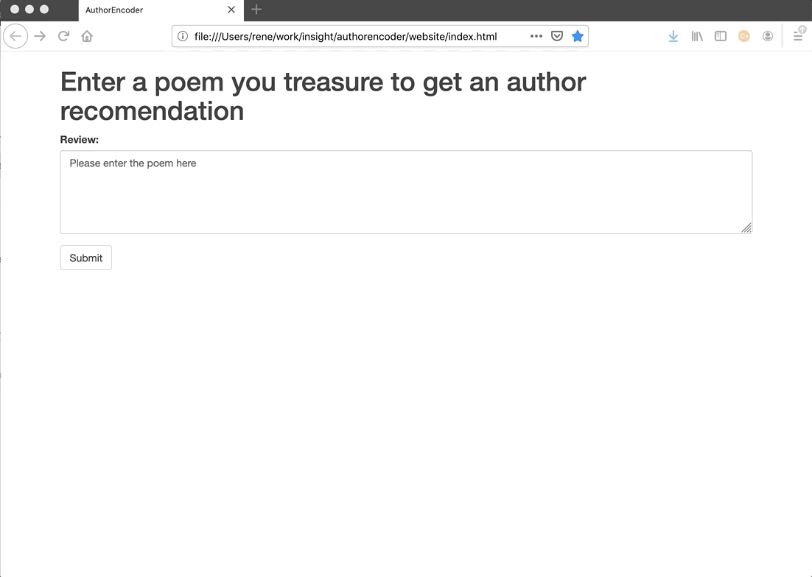

# AuthorEncoder

Find poetry authors who writes similar to your dearest poems.

Would it be great if,  after reading a touching poem, we could find authors who have similar ideas or style? To this end, I build a scalable recommendation system that takes  as input a poem and outputs authors that write similarly. Bookshops can scale this service to empower their customers, boosting sales and loyalty. The underlying AI results from applying computer vision techniques  to encode the legacy of a hundred of classic and modern poets. 

## AuthorEncoder in action

